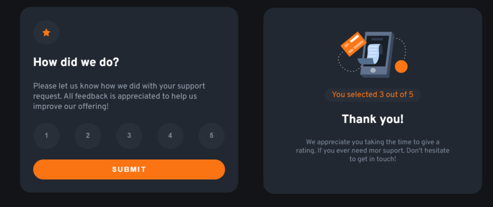

# $\color[RGB]{54,148,77}Interactive-Rating-FM$
Frontend mentor challenge, Interactive rating component.

<kbd>
  
</kbd>

$\color[RGB]{54,148,77} $

### $\color[RGB]{54,148,77}Built$ $\color[RGB]{54,148,77}with$
- Javascript
- CSS custom properties
- Flexbox

### $\color[RGB]{54,148,77} What$ $\color[RGB]{54,148,77} I$ $\color[RGB]{54,148,77} learned$
- Estructure most of the html with JS
- Practice with some animations
- A bit of 3d animation with CSS (i take references to make the card effect from this [project](https://codepen.io/jrgm0005/pen/zzJzxm))

## $\color[RGB]{54,148,77} Author $

- Website - [Live website](https://interactive-rating-theta.vercel.app)
- Frontend Mentor - [@Jocad7](https://www.frontendmentor.io/profile/Jocad7)

